# DAT250 Experiment 5

In this experiment, I've played with the MongoDB database.
I opted to use the built-in IntelliJ client instead of `mongosh` for better text editing support,
and more comprehensive screenshots.

## Screenshots

### 0. Validate package hash
I installed mongodb through homebrew. The homebrew package manager automatically checks hashes during installations.

Still, I validated it manually. Obtaining the expected hash of the tarball was difficult,
the best source I found was the one defined in the homebrew formula:
https://github.com/mongodb/homebrew-brew/blob/master/Formula/mongodb-community.rb#L12

I could not find the expected hash on any official mongodb website.

I manually checked the hash correctness like this (diff exiting with code 0 means they are equal):

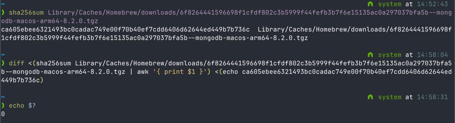

### 1.1. Insert documents

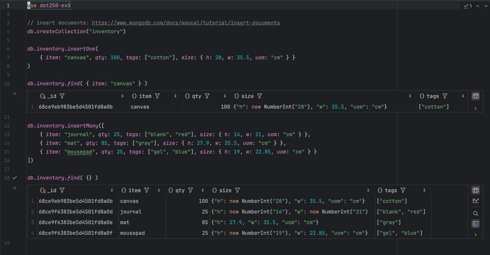

### 1.2. Query documents

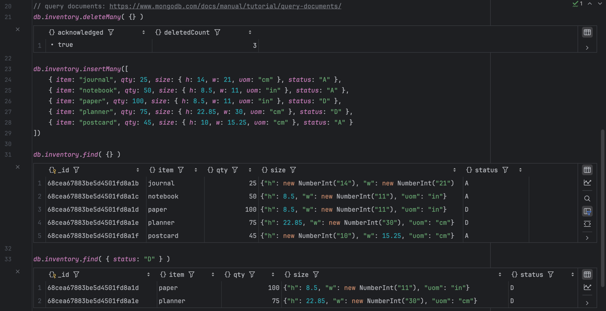

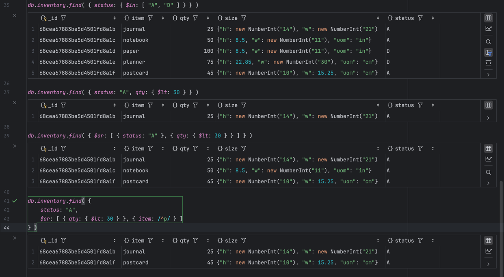

### 1.3. Update documents

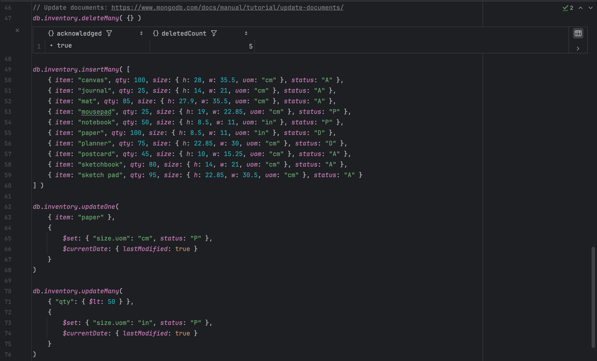

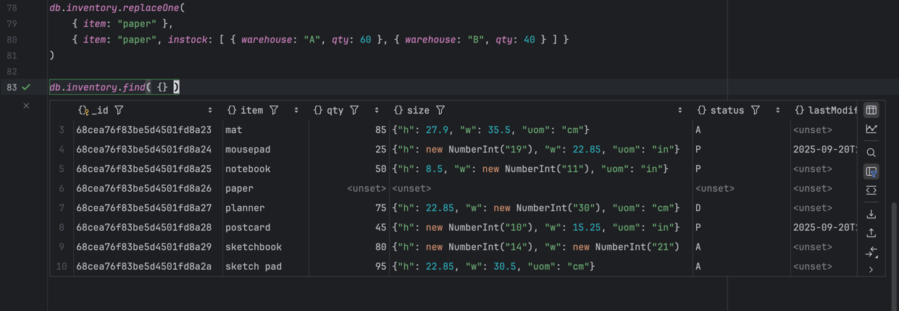

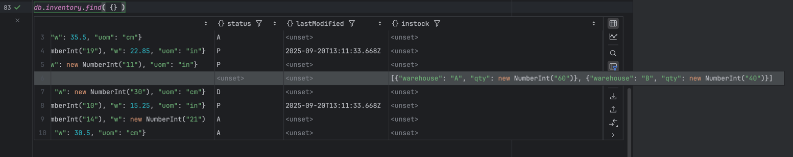

### 1.4. Delete documents

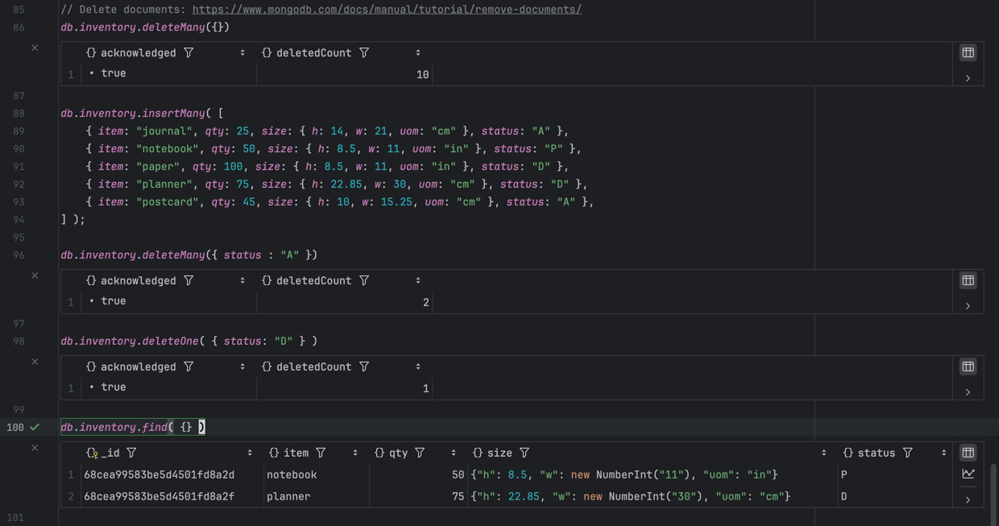

### 1.5. Bulk operations

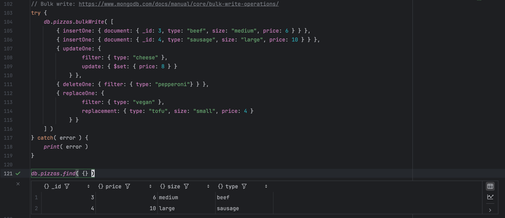

I couldn't get the new bulk-write across collections method to work in the IntelliJ client,
so here that is in `monogsh`:

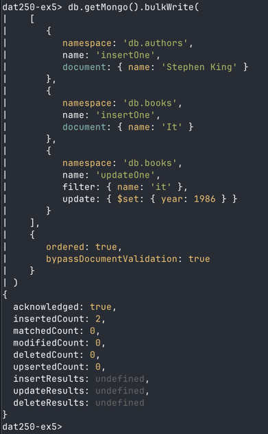

### 2.1. Aggregation, filter and subset

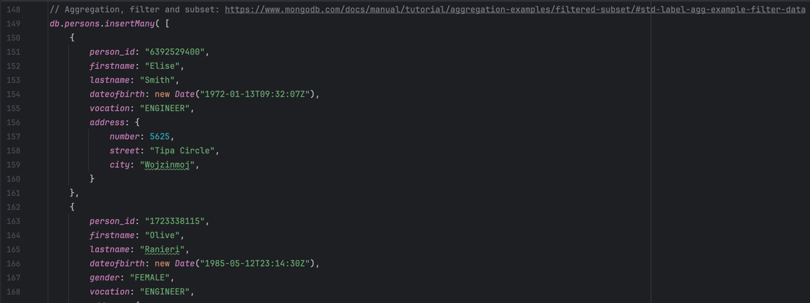

...

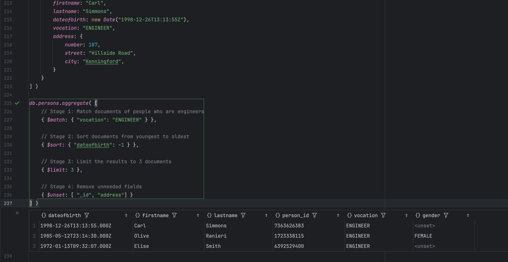

### 2.2. Aggregation, group and total

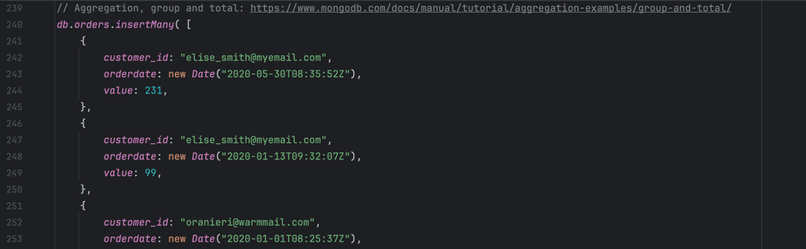

...

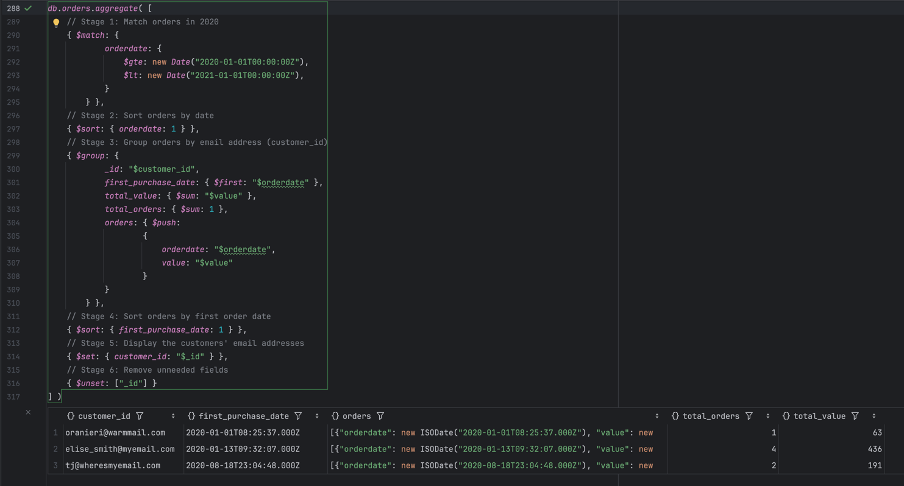

### 2.3. Aggregation, unwind Arrays and Group Data

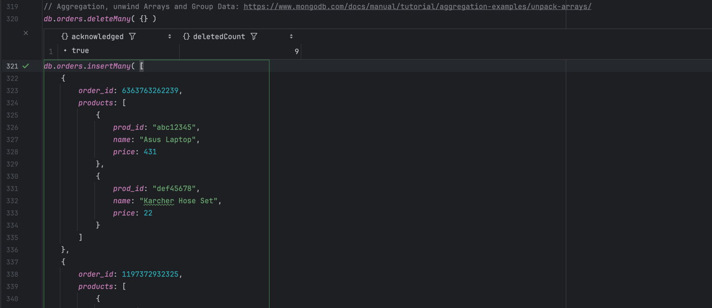

...

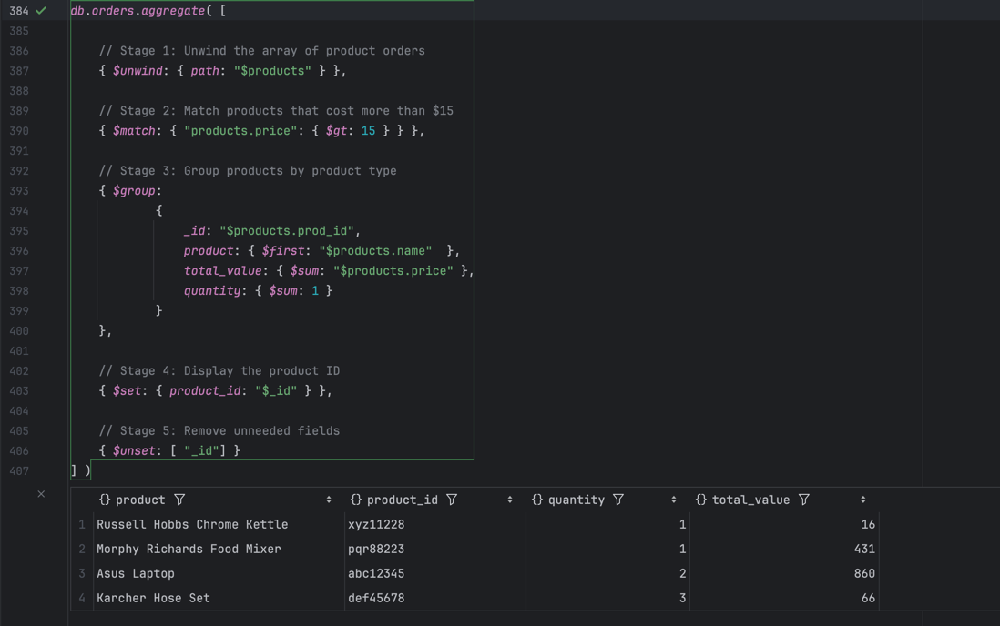

### 2.4. Aggregation, One-to-One join

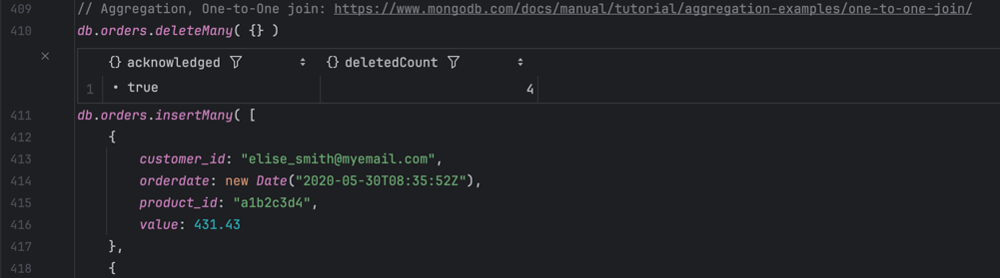

...

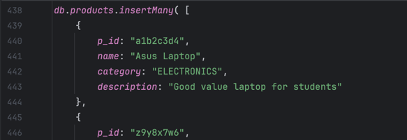

...

### 2.5. Aggregation, Multi-Field join

...

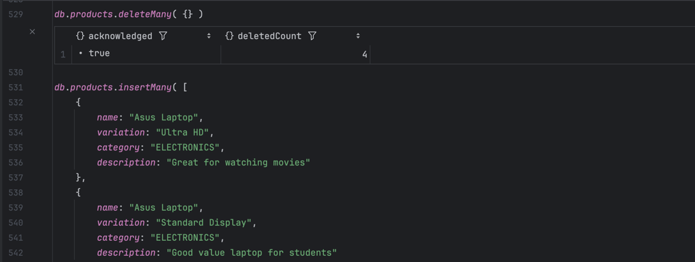

...

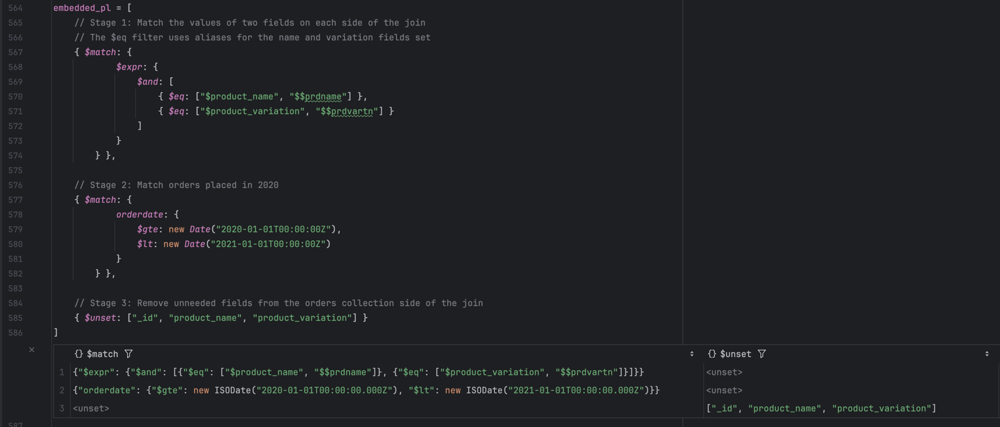

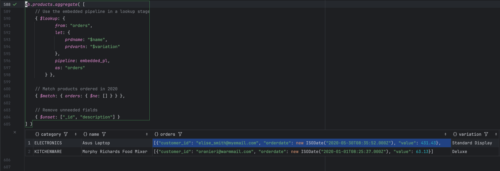

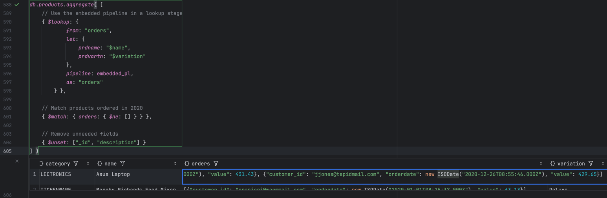

## Reflections on mongodb aggregation pipelines vs SQL

I think the mongodb pipelines way of doing aggregations might be more user-friendly than SQL.
The fact that it is imperative, breaking down the desired operations step by step, might be easier to 
understand if you're not intimately familiar with SQL.

The programming model of interacting with the database through functions and objects in your programming language
also allows for cleaner code and composition, compared to using a DSL in strings.
MongoDB might lend itself better to complex aggregation pipelines (for example with array unwinding) 
than SQL, where the alternative would likely include writing multiple CTEs.

Still, unless you're doing operations that lend themselves very well to a distributed map/reduce, allowing for the
aggregation to be run on a database cluster, I think the SQL way is more efficient, because you're declaring your goal,
not the means to get there.
There's been lots of work put into the development and optimization of SQL query planners and executors.
And the fact that most SQL databases use a schema likely allows for more efficient disk reads for the database engine.
Along with the well-established benefits of data integrity guarantees.

## Pending issues

I think the assignment text might be out-of-date compared to the actual documentation live on MongoDB.
For example in the lack of available hashes for the downloaded tarball,
and no references to a ZIP-code dataset where we can run map/reduce operations.

Still, I think I've implemented the assignment without problems according to the current mongodb docs.
